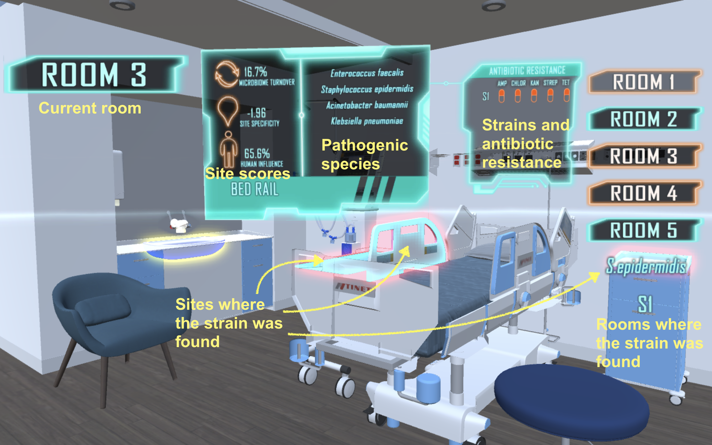

Hospital Microbiome Explorer
------

## Description

This project provides a proof-of-concept 3D model to explore the hospital microbiome survey data associated with our manuscript ([Chng *et al*, 2020](#citation)). 

  
## Installation

The compiled software is available at the [release page](https://github.com/lch14forever/hospital_microbiome_explorer/releases). The following platforms are supported:
 - [WebGL application](https://github.com/lch14forever/hospital_microbiome_explorer/releases/download/v1.0.1/hospitalExplorerWeb.zip): Windows 7 or Windows 10, Firefox (52 or newer) or Google Chrome (57 or newer)
 - [Windows executable](https://github.com/lch14forever/hospital_microbiome_explorer/releases/download/v1.0.1/HospitalExplorerPc.zip): Windows 7 or Windows 10

## Usage

Start the application by double clicking index.html (WebGL) or HospitalMicrobiomeExplorer.exe (Windows executable).
  
Key binds:
 - W: Move forward
 - A: Move left
 - S: Move back
 - D: Move right
 - Mouse: Camera movement
 - Q: Toggle camera movement (mouse cursor released for selection)
 - Space: Toggle "Scene Switch" menu

Data exploration:
 - Click the glowing object to toggle the display for site scores and opportunistic pathogens detected at this site. 
 - Click the species name to toggle the display for strains detected at this site and the associated antibiotic resistance profile. 
 - Click the strain name to show the distribution of the strain across sites (highlighted in red) and rooms (highligted in orange on the right panel).

## Citation

Chng *et al*. (2020). Cartography of opportunistic pathogens and antibiotic resistance genes in a tertiary hospital environment. *Nature Medicine* ([journal version](https://www.nature.com/articles/s41591-020-0894-4), [bioRxiv version](https://www.biorxiv.org/content/10.1101/644740v2)).

## Contact

Please direct any questions or feedback to [Licheng Xu](mailto:licheng_xu@mymail.sutd.edu.sg), [Chenhao Li](mailto:lich@gis.a-star.edu.sg) and [Niranjan Nagarajan](mailto:nagarajann@gis.a-star.edu.sg).

